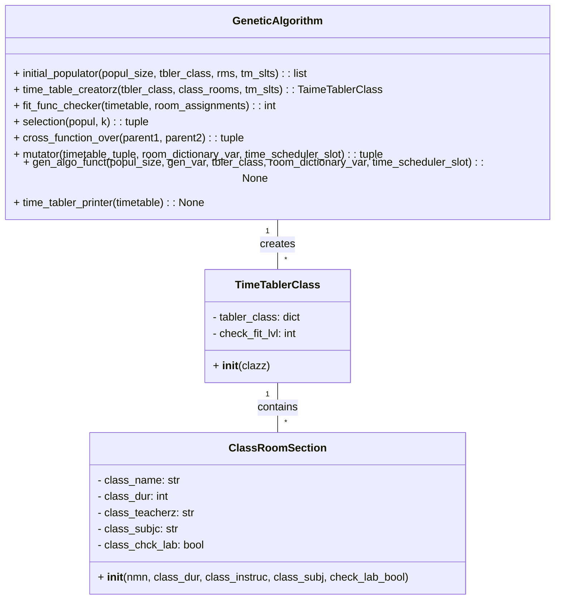
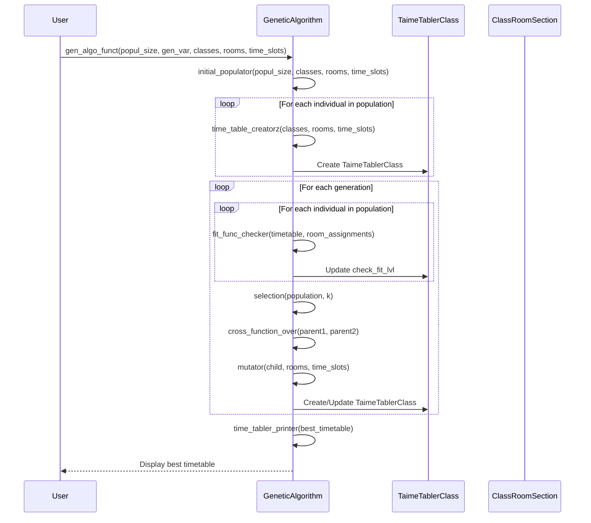

# TimeTable-Scheduler-Genetic-Algorithm

[](LICENSE)
[](https://www.python.org/downloads/)

This repository contains a robust Python implementation of a genetic algorithm designed to tackle the complex timetable scheduling problem. By leveraging the power of evolutionary computation, this project aims to generate optimal timetables that minimize conflicts and satisfy a variety of hard and soft constraints.

## Project Overview

The timetable scheduling problem is a quintessential challenge in academic institutions. It involves the intricate task of assigning courses to specific time slots and rooms, ensuring that no conflicts arise between professors, students, or resources. This project provides a sophisticated solution using a genetic algorithm, which mimics the process of natural selection to evolve the best possible timetable.
Timetable scheduling problem is implemented with hard constraints and soft constraint using binary chromosome encoding to minimize conflicts, that adheres to class length, break times, and session preferences, with a fitness function that penalizes constraint violations.
**Key Objectives:**

-   **Conflict Minimization:** Reduce clashes between professors, sections, and rooms.
-   **Constraint Satisfaction:** Adhere to both hard and soft constraints to ensure a feasible timetable.
-   **Optimization:** Generate high-quality timetables that meet academic requirements.

## Features

-   **Genetic Algorithm Implementation:** Utilizes selection, crossover, and mutation to evolve optimal timetables.
-   **Constraint Handling:** Incorporates hard constraints (e.g., professor and section limits) and soft constraints (e.g., floor preferences).
-   **Fitness Function:** Evaluates the quality of timetables based on constraint satisfaction and other criteria.
-   **Modular Design:** Code is structured for easy modification and extension.
-   **Detailed Output:** Provides clear and comprehensive timetable schedules.

## Constraint Rubric

The algorithm meticulously adheres to the following constraints:

**Hard Constraints:**

-   **Classroom Availability:** Classes can only be scheduled in free classrooms.
-   **Classroom Capacity:** A classroom should be big enough to accommodate the section.
-   **Professor Conflict:** A professor should not be assigned two different lectures at the same time.
-   **Section Room Conflict:** The same section cannot be assigned to two different rooms at the same time.
-   **Room Section Conflict:** A room cannot be assigned for two different sections at the same time.
-   **Professor Course Limit:** No professor can teach more than 3 courses.
-   **Section Course Limit:** No section can have more than 5 courses in a semester.
-   **Lecture Distribution:** Each course would have two lectures per week not on the same or adjacent days.
-   **Lab Lecture Scheduling:** Lab lectures should be conducted in two consecutive slots.


**Soft Constraints:**

-   **Session Timing:** All theory classes should be taught in the morning session, and all lab sessions should be conducted in the afternoon session.
-   **Floor Minimization:** Teachers/students may be facilitated by minimizing the number of floors they have to traverse.
-   **Classroom Consistency:** A class should be held in the same classroom across the whole week.
-   **Teaching Blocks:** Teachers may prefer longer blocks of continuous teaching time to minimize interruptions and maximize productivity, except when the courses are different.

## Code Structure

-   `TimeSchedularizer.py`: Contains the core implementation of the genetic algorithm and related functions.
-   `README.md`: Provides an overview of the project and usage instructions.

## UML Diagrams

### Class Diagram


### Sequence Diagram




## Usage

1. **Clone the repository:**

   ```bash
   git clone [https://github.com/nouman-x-ahmad/TimeScheduler.git](https://github.com/nouman-x-ahmad/TimeScheduler.git)
   cd TimeScheduler/TimeScheduling\ problem

2. **Run the Script:**
   ```bash
   python TimeSchedularizer.py
3. **Small Snippet of Output:** 


## License:
This project is licensed under the MIT License. See the LICENSE file for more information
